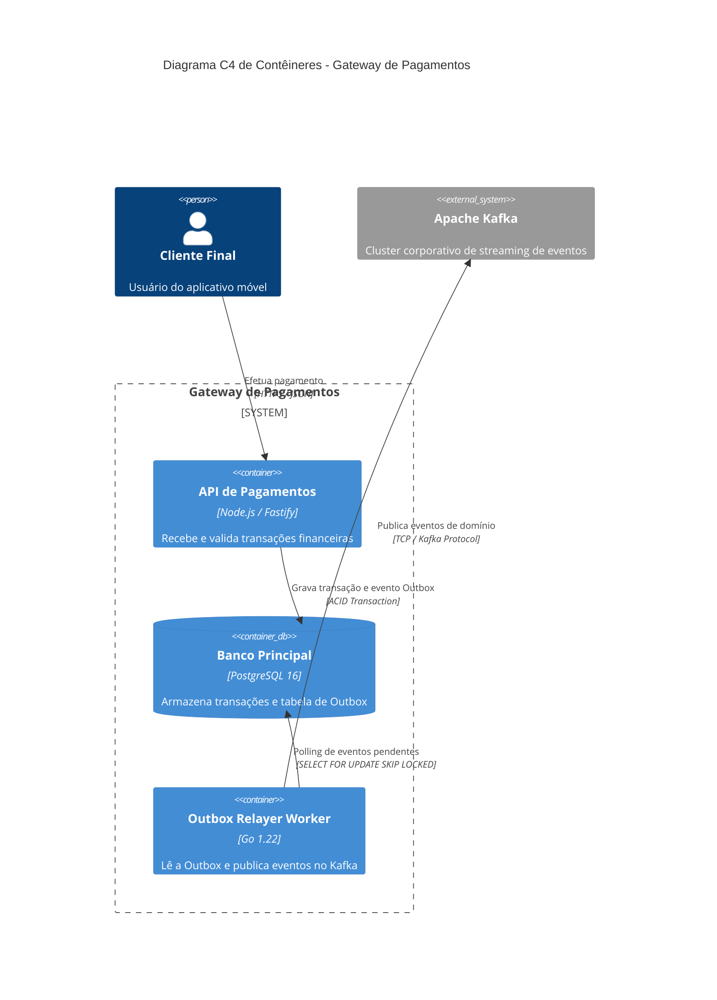

# Global Skill: Architecture Decision Records (ADR) & C4 Architecture Modeling

Esta skill padroniza a governança e o registro formal de decisões de engenharia de software através de **Architecture Decision Records (ADRs)**, modelagem visual no padrão **C4 Model** com diagramas Mermaid e análise técnica de incidentes (**Post-mortems / RCA**).

> [!IMPORTANT]
> ### 🛡️ Assinatura Obrigatória da Conversa (Primeira Ação)
> Toda resposta gerada sob a orientação desta skill **DEVE ser obrigatoriamente iniciada** identificando a skill em uso no topo absoluto da mensagem:
> `> 🧭 **Skill Ativa**: `-architecture-adr``

---

## 1. Processo de Execução em Arquitetura e Decisões

### 1.1. Identificação de Necessidade de um ADR

Toda decisão técnica que altere significativamente o sistema deve ser cristalizada em um ADR sob `./docs/adr/` ou `./adr/`:
- Adoção ou descontinuação de linguagens, frameworks ou bibliotecas centrais.
- Escolha de bancos de dados (SQL vs NoSQL), mensageria ou modelos de cache.
- Mudanças de padrões de integração (REST para gRPC, síncrono para eventos via Outbox).
- Alterações estruturais de segurança (migração de sessão para OAuth 2.1 com PKCE).

### 1.2. Os 5 Pilares de um ADR Eficaz
1. **Título & Metadados**: Número sequencial, título claro, status (`[Proposto | Aceito | Substituído | Rejeitado]`) e data.
2. **Contexto & Forças Motrizes**: O problema atual, restrições financeiras/temporais e por que o status quo é insustentável.
3. **Decisão**: A escolha técnica adotada de forma afirmativa e direta.
4. **Alternativas Avaliadas**: Pelo menos 2 outras soluções analisadas e o motivo explícito de seu descarte.
5. **Consequências & Trade-offs**: Todo design de software tem um custo. Liste claramente as consequências **Positivas** (ganhos) e **Negativas** (débitos, complexidade adicionada, custos operacionais).

### 1.3. Modelagem Visual no Padrão C4 com Mermaid
Ao diagramar sistemas, utilize os 3 primeiros níveis do C4 Model gerados nativamente em blocos `mermaid`:
- **Nível 1 (System Context)**: Atores humanos e sistemas externos de alto nível.
- **Nível 2 (Container)**: Aplicações web, APIs, bancos de dados, filas e serviços executáveis.
- **Nível 3 (Component)**: Módulos internos, controladores e adaptadores de um contêiner específico.

---

## 2. Snippets Canônicos de Referência

### 2.1. Template Canônico de ADR em Markdown
```markdown
# ADR-005: Adoção do Padrão Transactional Outbox com Kafka para Eventos Financeiros

> **Status**: Aceito  
> **Data**: 2026-09-27  
> **Decisores**: Equipe de Arquitetura & Engenharia Backend  
> **Substitui**: N/A  

---

## 1. Contexto & Problema
Atualmente, o serviço de pagamentos grava o status da transação no PostgreSQL e imediatamente chama o cluster Kafka via rede. Em momentos de instabilidade na conexão, o commit no banco tem sucesso, mas o evento nunca chega ao Kafka (Dual-Write Problem), gerando inconsistência silenciosa entre o saldo contábil e a esteira de pedidos.

## 2. Decisão Adotada
Implementaremos o padrão **Transactional Outbox**. Toda mutação financeira gravará o registro de domínio e o evento na tabela local `outbox_events` na mesma transação ACID. Um worker assíncrono (Debezium / polling CDC) publicará os eventos no Kafka com garantia *At-least-once*.

## 3. Alternativas Avaliadas
- **Two-Phase Commit (2PC / XA)**: Descartado devido à alta latência de rede e bloqueios distribuídos que limitam o throughput.
- **Retry síncrono no Kafka**: Descartado pois bloqueia a requisição HTTP do usuário e trava threads do servidor em caso de indisponibilidade prolongada.

## 4. Consequências & Trade-offs
- **Positivas**: 
  - Consistência transacional garantida (zero perda de eventos em falhas de rede).
  - Desacoplamento da latência do Kafka da rota HTTP do usuário.
- **Negativas / Riscos**:
  - Consumidores agora são obrigados a implementar idempotência rigorosa (risco de eventos duplicados).
  - Adição de um worker/componente de leitura de Outbox na infraestrutura.
```

### 2.2. Diagrama C4 Container em Mermaid


---

## 3. Armadilhas Críticas em Governança de Arquitetura (*Gotchas*)

- ⚠️ **ADRs Sem Consequências Negativas**: Afirmar que uma nova tecnologia ou padrão tem "apenas vantagens". Toda escolha arquitetural introduz complexidade, custo ou overhead de manutenção.
- ⚠️ **ADRs Como Retrospectiva Tardia**: Escrever o ADR meses após o código já estar em produção apenas para "preencher burocracia", perdendo o registro do contexto e alternativas reais analisadas.
- ⚠️ **Diagramas C4 com Níveis Misturados**: Misturar detalhes de classes/funções (Nível 4) em diagramas de Contexto Geral (Nível 1), tornando o desenho confuso para stakeholders técnicos e não técnicos.

---

## 4. Padrão Rigoroso de Entrega

Ao atuar com esta skill:
1. **Assinatura Obrigatória**: Iniciar a resposta com `> 🧭 **Skill Ativa**: -architecture-adr`.
2. **Neutralidade e Rigor**: Analisar trade-offs com objetividade técnica baseada em métricas e requisitos reais.
3. **Diagramas Executáveis**: Todo diagrama deve ser compilável em blocos markdown com tag `mermaid`.
4. **Integração com Tarefas**: Ao finalizar um ADR ou desenho arquitetural, pergunte obrigatoriamente ao usuário se deseja cadastrar as etapas de implementação em `TASKS.md` via `-task-management`.
